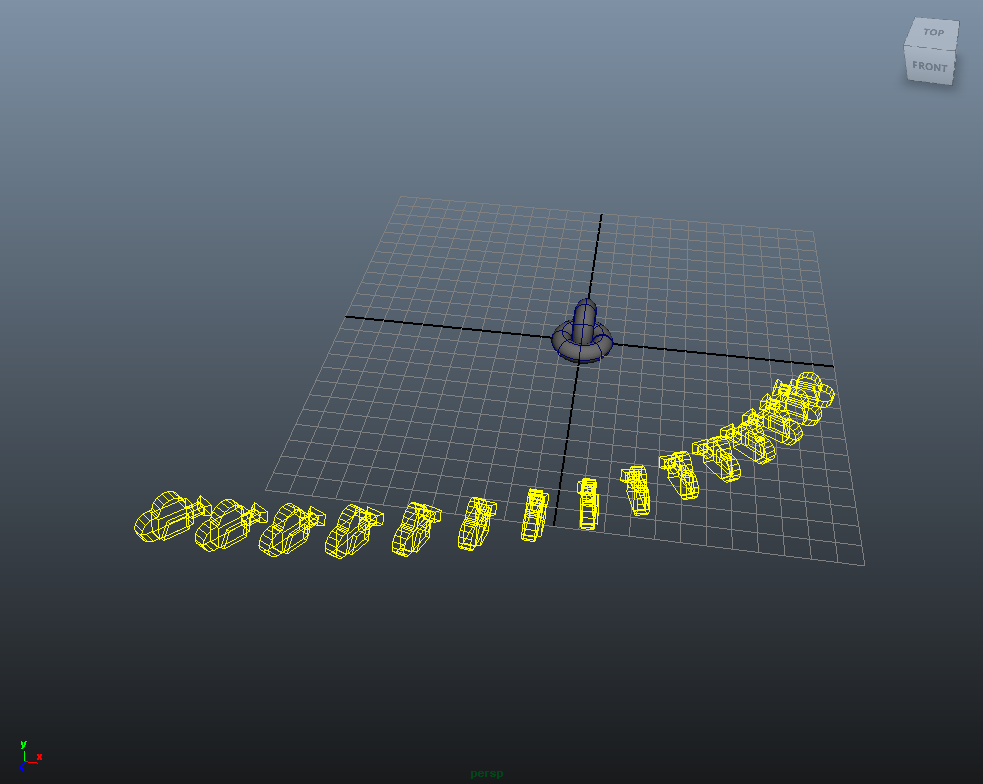
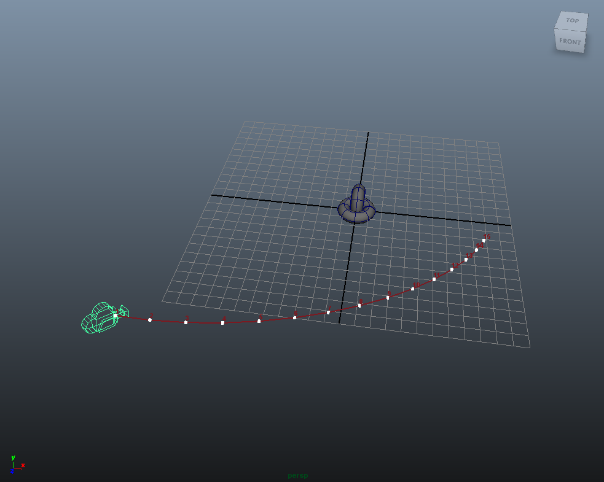
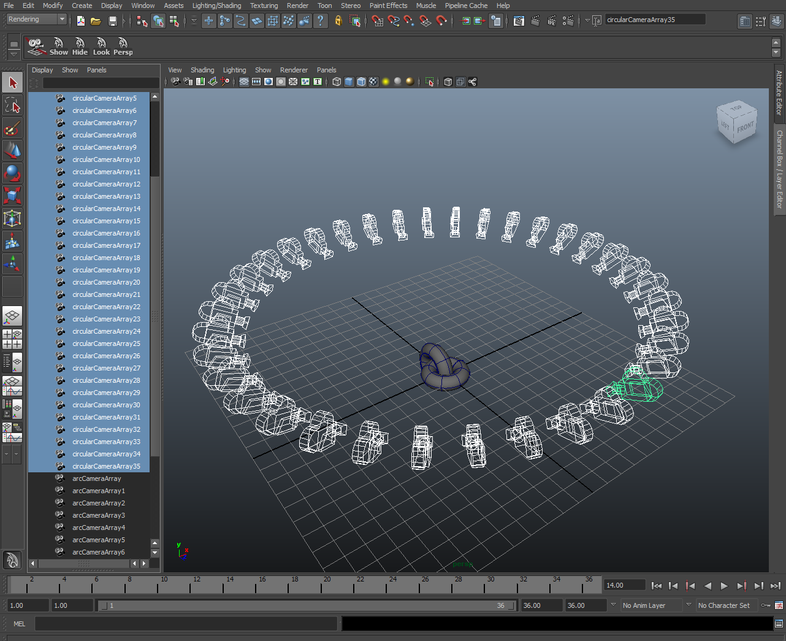
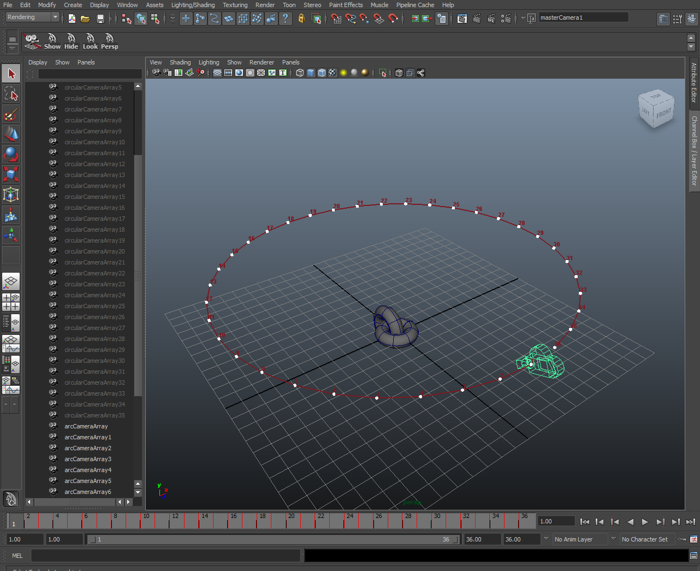
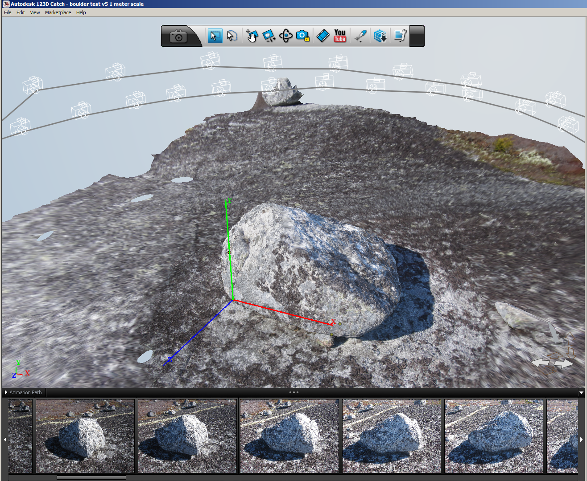
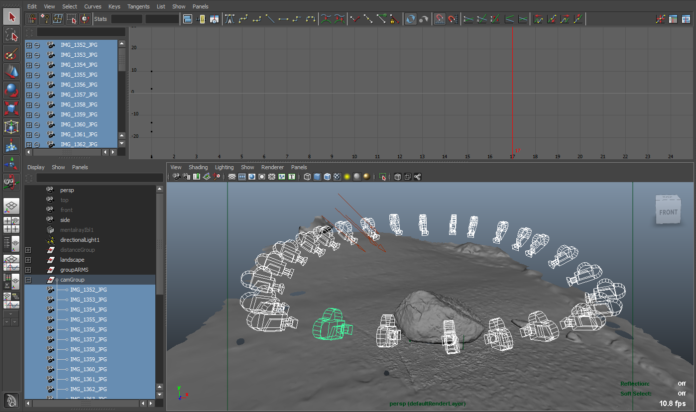
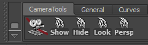

# CameraSnap.mel #

Version:  1.0  
Creation Date: March 28, 2013  

 
## Contact ##

Author: Andrew Hazelden   
Email: andrew@andrewhazelden.com  
Web: http:www.andrewhazelden.com  

## About the Script ##

CameraSnap.mel takes a list of selected cameras in your scene as an input and creates a new camera with an animation path that moves through the position of each of the original input cameras. The script was created to convert the dozens of still cameras imported from a photogrammetry program like Autodesk 123D Catch into a single camera animation path.

This script could also be used for converting a matrix style time-slice rig aka. "bullet-time" camera rig in your Maya scene into a single camera with a path animation that can be playedback in the viewport and controlled using Maya's normal time controls.

## Screenshots ##

CameraSnap takes your multi-camera Maya scenes that are typically created from bullet-time rigs, photogrammetry, or video photogrammetry systems as the camera position input data source:

Then the CameraSnap script can be run to create a new clean camera animation path that navigates the viewer through each of the original camera view positions. This allows you to create and render out the scene using a single camera on a path from what would otherwise be a complex scene with hundreds of Maya cameras.

If the multi-camera objects in the Maya scene are named and arranged correctly, CameraSnap will work successfully with camera arrays travelling in a linear fashion through the scene, on handheld video derived multi-camera positions, or even cameras in a circular ring style layout that orbits around a character or object in the scene.

The output from CameraSnap is always an animation curve with one keyframe knot placed in the curve for each camera in the multi-camera array input selection. The keyframes are numbered and shown visually on the curve by default when the CameraSnap script is run.

CameraSnap was originally created to help work with footage from any of the selected cameras in your Maya scene, from AGI Photoscan imported FBX camera data in Maya, or from data created and saved from the original Autodesk 123D Catch software (which is no longer available).

With CameraSnap it is often easiest to select the camera views you want to process using Maya's Outliner view. This makes sure you don't leave any cameras behind when generating the animation path. 

You can also add the individual cameras to your selection list using Maya's 3D views and then run CameraSnap but it can be difficult sometimes to do accurately if you've got a complex maya scene.

Since CameraSnap outputs a standard set of XYZ rotation and translation based animation curves in Maya, you can apply smoothing or curve tangent adjustments easily using Maya's powerful animation environment. You can also scale the keyframes that are generated by CameraSnap so you could turn a 24 camera array clip that would last for 1 second if it was played back at 24 fps, into an interpolated 144 frame long sequence in Maya's Graph Curve Editor window.

Below is a view of the CameraSnap shelf in Maya that is titled "CameraTools". There are five shelf buttons that allow you to run CameraSnap, Show Cameras, Hide Cameras, Lock Selected, and Switch to the Perspective View.

Once you have multiple cameras selected in your scene you can click on and run the first shelf button, which is labelled "CameraSnap", to launch the `CameraSnap.mel` script and generate your camera animation path.

## Usage ##

Select a group of cameras in the outliner or a viewport. Click the Camera Snap icon in the shelf to create a new animated camera that will move through the position of each of the input cameras in the original camera 'array'.

The output duration of the new camera rig animation is based upon the total number of cameras in the original selection. By default the new camera animation path is set to use linear tangents.

## Clipping Plane Notes ##

If you adjust the near clipping distance the for new camera, the motion trail handle control knots might become visible in the masterCamera1 camera view. In this case you can manually hide the motion trail before you play the camera animation back.

## CameraSnap Script Installation ##

The `CameraSnap.mel` script works with Maya 2010-2018 on Windows/Mac/Linux.

### Windows MEL Script Install: ###

#### Step 1.####

To load the CameraSnap.mel script in Maya copy the MEL script file to your user account's Maya scripts folder.

On Windows the script folder is located in the folder:

`My Documents\maya\<maya version number>\prefs\scripts`

In this case `<maya version number>` is a placeholder for your actual Maya release number like "`2014-x64`". 

#### Step 2.####

 Copy the shelf tool to the Maya Shelves folder:

`My Documents\maya\<maya version number>\prefs\shelves`

#### Step 3.####

Copy the icons to the Maya Shelves folder:

`My Documents\maya\<maya version number>\prefs\icons`

------------------------------------------------------------

### Mac OS X MEL Script Install ###

To load `the CameraSnap.mel` script in Maya copy the MEL script file to your user account's Maya scripts folder.

#### Step 1.####

On mac os X the folder is located in your preferences folder.

`~/Library/Preferences/Autodesk/maya/<maya version number>/prefs/scripts`

In this case <maya version number> is a placeholder for your actual Maya release number like "`2014-x64`".

#### Step 2.####

You can open the hidden Library folder on Mac OS X by using the Finder > Go to Folder menu item. Paste in the value:

`~/Library/Preferences/Autodesk/maya/` and hit the "go" button.

#### Step 3.####

Copy the shelf tool to the Maya Shelves folder:

`~/Library/Preferences/Autodesk/maya/<maya version number>/prefs/shelves`

#### Step 4.####

Copy the icons to the Maya Shelves folder:

`~/Library/Preferences/Autodesk/maya/<maya version number>/prefs/icons`

### Linux Script Install ###

The installation on Linux follows the same type of conventions as the Mac/Windows installation does of copying over the MEL script, the shelf, and the icons. If you use Maya on Linux then you likely know the procedure off by heart.
